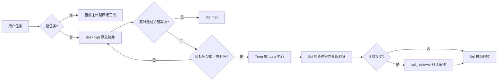

# Codex Quality Orchestrator

面向 Codex 子代理的质量优先路由插件。它让 Sol 负责语义判断与最终验收，使用 Hook 机械限制模型、推理档位和 `fork_turns`，并为关键变更提供独立只读审核。

## 路由原则



质量与胜任能力优先于速度和成本。Hook 不判断任务语义，也不会自动选择模型；它只拒绝违反已确认边界的调用。

短任务必须同时无歧义、低风险、无需方案选择或诊断、上下文很少且可直接验证；文件数、改动量和验证步骤数量只能作为辅助信号，高风险事项无论大小都不是短任务。对非短任务，Sol 按完整工作单元的最高能力要求选择有安全余量的最低胜任层级：输入输出与步骤固定且无需判断的机械子任务才使用 Luna；需要实现判断、多步骤上下文、调试、测试或已裁定接口下普通集成的边界清晰工作使用 Terra；目标、范围或验收不清以及架构、安全、生产数据、跨代理最终集成和最终裁决保留给 Sol。仅在边界明确而 Luna 与 Terra 的能力档位难以判断时选择 Terra。同一工作单元的生产执行者和最低能力层级保持稳定，正常交回 Sol 整合与验收不属于改派。

`Sol / xhigh` 是普通非短任务的建议根档位，不是 Hook 能强制改写的设置。根任务模型和档位在插件运行前由桌面模型选择器、外部配置管理器或 `config.toml` 决定；高风险任务使用 `max`，`ultra` 只用于极少数超复杂长任务。

完整矩阵见 [docs/ROUTING_MATRIX.md](docs/ROUTING_MATRIX.md)。

## 包含内容

- `SessionStart` Hook：加载精简 Rule 16，并检测全局规则冲突。
- `PreToolUse` Hook：校验具名代理、模型覆盖、推理档位和 `fork_turns`。
- 三个代理模板：`terra_worker`、`luna_worker`、`sol_reviewer`。
- 显式安装、卸载、验证和打包脚本。
- 静态路由矩阵测试不产生模型调用费用；运行时烟雾验证会启动一次临时只读宿主会话。

## 安装

从 GitHub 安装，不依赖当前工作目录或 CC Switch：

```powershell
$install = codex plugin marketplace add 9holy/codex-quality-orchestrator --ref main --json | ConvertFrom-Json
$plugin = codex plugin add "codex-quality-orchestrator@$($install.marketplaceName)" --json | ConvertFrom-Json
powershell -NoProfile -ExecutionPolicy Bypass -File (Join-Path $plugin.installedPath 'scripts\install.ps1')
codex plugin list --json
```

安装脚本只安装具名代理配置。已有配置满足关键契约时保持不动；存在冲突时默认停止且不修改任何文件。只有明确确认后才使用 `-Force`，脚本会先建立同目录时间戳备份再替换。

安装插件后，在 Codex CLI 中使用 `/hooks` 审核并信任插件 Hook，然后新建任务。现有任务不会热加载新的 Rule 16 或代理配置。

`codex plugin list --json` 必须显示插件已经安装且启用；仅有 `~/.codex/plugins/cache` 目录不能证明插件或 Hook 正在生效。

如果任何提供商切换器、同步工具或脚本会整体替换 `config.toml`，可在人工信任两项 Hook 后启用通用配置守护器：

```powershell
powershell -NoProfile -ExecutionPolicy Bypass -File (Join-Path $plugin.installedPath 'scripts\config-guard.ps1') -Mode Install
```

守护器不依赖具体切换工具，也不调用模型。它只在 `config.toml` 变化后检查状态，缺失时通过原生 `codex plugin` 命令恢复 marketplace 和插件启用项，并恢复用户已经批准的精确 Hook 哈希；Hook 定义变化或哈希冲突时会停止恢复并要求重新审核。无需切换配置的用户不必启用它。

自动随登录启动的 `Install` 模式目前仅支持 Windows；`Repair` 单次修复模式可在装有 PowerShell 的其他平台使用。

安装并信任 Hook 后，运行真实宿主烟雾验证。该命令启动一次临时只读 `codex exec`，由 SessionStart Hook 将随机 nonce 写入受限于系统临时目录的证明文件；脚本只校验证明文件，不让模型自报 Hook 状态。成功时返回 `SessionStartHookTrust=PASS` 和 `SessionStart=PASS`，发现全局 Rule 16 冲突或缺少具名代理配置时会失败：

```powershell
powershell -NoProfile -ExecutionPolicy Bypass -File .\plugins\codex-quality-orchestrator\scripts\runtime-smoke.ps1
```

烟雾脚本不会使用 `--dangerously-bypass-hook-trust`。当前 SessionStart 定义尚未通过 `/hooks` 持久信任、定义已变化或 Hook 未加载时，验证必须失败，不能把一次性信任旁路当作通过证据。该结果不证明独立的 PreToolUse 定义已信任；在 `/hooks` 审核两项定义并实际确认非法代理调用被拒绝前，不得移除旧全局路由 Hook。

插件系统目前不会从插件包原生注册自定义代理，因此显式运行安装脚本是必要步骤；Hook 不会静默写入 `~/.codex`。

## 验证

```powershell
powershell -NoProfile -ExecutionPolicy Bypass -File .\plugins\codex-quality-orchestrator\scripts\verify.ps1
```

静态验证包括 JSON、Node 与 PowerShell 语法、manifest、TOML 代理契约、Rule 16 一致性、SessionStart 脚本输出契约，以及完整允许/拒绝路由矩阵。在源码仓库中还会校验 marketplace；在独立插件目录中不依赖仓库外文件。静态验证不等于宿主已加载 Hook，安装后的实际链路以 `runtime-smoke.ps1` 为准。

## 打包

```powershell
powershell -NoProfile -ExecutionPolicy Bypass -File .\plugins\codex-quality-orchestrator\scripts\package.ps1
```

产物写入 `dist/codex-quality-orchestrator-<version>.zip`，打包脚本会强制使用可移植的 `/` 条目路径，拒绝反斜杠条目，解压成品并复跑独立验证，然后输出 SHA-256。

## 卸载

```powershell
powershell -NoProfile -ExecutionPolicy Bypass -File (Join-Path $HOME '.codex\.codex-quality-orchestrator-guard\config-guard.ps1') -Mode Uninstall
codex plugin remove codex-quality-orchestrator@codex-quality-orchestrator --json
powershell -NoProfile -ExecutionPolicy Bypass -File .\plugins\codex-quality-orchestrator\scripts\uninstall.ps1
codex plugin marketplace remove codex-quality-orchestrator --json
```

未启用配置守护器时跳过第一条命令。代理卸载脚本依据安装状态只处理插件真正创建或替换的配置。插件创建且未修改的文件会删除；`-Force` 替换且未再修改的文件会恢复安装前版本；用户原有或安装后修改过的配置会保留。

## 安全边界

- 运行时 Hook 不联网、不上传数据、不收集遥测；只读取插件策略、本地代理配置和全局 `AGENTS.md` 中的 Rule 16 片段。
- 安装脚本会写入具名代理配置；只有用户显式启用的配置守护器会额外写入自身状态、Windows 启动项和带备份的 `config.toml` 注册项。
- 守护器本身不调用模型；恢复本地 marketplace 不联网，恢复 Git marketplace 时会由原生 `codex plugin marketplace add` 访问已记录的 Git 来源。
- `codex-auto-review / low` 是 Codex 系统权限审查，不属于本插件的工作模型矩阵。

## 许可证

[MIT](LICENSE)

## 完整操作说明

模型矩阵、调用契约、Hook 边界、安装所有权、卸载恢复、验证和发布流程见 [docs/OPERATING_GUIDE.md](docs/OPERATING_GUIDE.md)。
