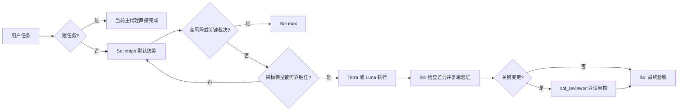

# Codex Quality Orchestrator

面向 Codex 子代理的质量优先路由插件。它让 Sol 负责语义判断与最终验收，使用 Hook 机械限制模型、推理档位和 `fork_turns`，并为关键变更提供独立只读审核。

## 路由原则



质量与胜任能力优先于速度和成本。Hook 不判断任务语义，也不会自动选择模型；它只拒绝违反已确认边界的调用。

对非短任务，Sol 必须先检查是否存在边界清晰、可独立验收的工作单元。目标代理能够可靠胜任且下派不降低质量时，原则上应交给 Terra 或 Luna；不能只因当前 Sol 档位更高就把全部工作保留。任务太短或上下文无法安全隔离时仍由 Sol 直接完成，这不是代理调用配额。

`Sol / xhigh` 是普通非短任务的建议根档位，不是 Hook 能强制改写的设置。根任务模型和档位在插件运行前由桌面模型选择器、CC Switch 或 `config.toml` 决定；高风险任务使用 `max`，`ultra` 只用于极少数超复杂长任务。

完整矩阵见 [docs/ROUTING_MATRIX.md](docs/ROUTING_MATRIX.md)。

## 包含内容

- `SessionStart` Hook：加载精简 Rule 16，并检测全局规则冲突。
- `PreToolUse` Hook：校验具名代理、模型覆盖、推理档位和 `fork_turns`。
- 三个代理模板：`terra_worker`、`luna_worker`、`sol_reviewer`。
- 显式安装、卸载、验证和打包脚本。
- 静态路由矩阵测试不产生模型调用费用；运行时烟雾验证会启动一次临时只读宿主会话。

## 本地安装

在仓库根目录执行：

```powershell
powershell -NoProfile -ExecutionPolicy Bypass -File .\plugins\codex-quality-orchestrator\scripts\install.ps1
codex plugin marketplace add .
codex plugin add codex-quality-orchestrator@codex-quality-orchestrator --json
codex plugin list --json
```

安装脚本只安装具名代理配置。已有配置满足关键契约时保持不动；存在冲突时默认停止且不修改任何文件。只有明确确认后才使用 `-Force`，脚本会先建立同目录时间戳备份再替换。

安装插件后，在 Codex CLI 中使用 `/hooks` 审核并信任插件 Hook，然后新建任务。现有任务不会热加载新的 Rule 16 或代理配置。

`codex plugin list --json` 必须显示插件已经安装且启用；仅有 `~/.codex/plugins/cache` 目录不能证明插件或 Hook 正在生效。若 CC Switch 或其他配置管理工具覆盖了 marketplace/插件注册，应先恢复注册再新建任务。

安装并信任 Hook 后，运行真实宿主烟雾验证。该命令启动一次临时只读 `codex exec`，由 SessionStart Hook 将随机 nonce 写入受限于系统临时目录的证明文件；脚本只校验证明文件，不让模型自报 Hook 状态。成功时返回 `SessionStartHookTrust=PASS` 和 `SessionStart=PASS`，发现全局 Rule 16 冲突或缺少具名代理配置时会失败：

```powershell
powershell -NoProfile -ExecutionPolicy Bypass -File .\plugins\codex-quality-orchestrator\scripts\runtime-smoke.ps1
```

烟雾脚本不会使用 `--dangerously-bypass-hook-trust`。当前 SessionStart 定义尚未通过 `/hooks` 持久信任、定义已变化或 Hook 未加载时，验证必须失败，不能把一次性信任旁路当作通过证据。该结果不证明独立的 PreToolUse 定义已信任；在 `/hooks` 审核两项定义并实际确认非法代理调用被拒绝前，不得移除旧全局路由 Hook。

插件系统目前不会从插件包原生注册自定义代理，因此显式运行安装脚本是必要步骤；Hook 不会静默写入 `~/.codex`。

## 验证

```powershell
powershell -NoProfile -ExecutionPolicy Bypass -File .\plugins\codex-quality-orchestrator\scripts\verify.ps1
```

静态验证包括 JSON、Node 与 PowerShell 语法、manifest、TOML 代理契约、Rule 16 一致性、SessionStart 脚本输出契约，以及完整允许/拒绝路由矩阵。在源码仓库中还会校验 marketplace；在独立插件目录中不依赖仓库外文件。静态验证不等于宿主已加载 Hook，安装后的实际链路以 `runtime-smoke.ps1` 为准。

## 打包

```powershell
powershell -NoProfile -ExecutionPolicy Bypass -File .\plugins\codex-quality-orchestrator\scripts\package.ps1
```

产物写入 `dist/codex-quality-orchestrator-<version>.zip`，打包脚本会强制使用可移植的 `/` 条目路径，拒绝反斜杠条目，解压成品并复跑独立验证，然后输出 SHA-256。

## 卸载

```powershell
codex plugin remove codex-quality-orchestrator@codex-quality-orchestrator --json
powershell -NoProfile -ExecutionPolicy Bypass -File .\plugins\codex-quality-orchestrator\scripts\uninstall.ps1
codex plugin marketplace remove codex-quality-orchestrator --json
```

卸载脚本依据安装状态只处理插件真正创建或替换的配置。插件创建且未修改的文件会删除；`-Force` 替换且未再修改的文件会恢复安装前版本；用户原有或安装后修改过的配置会保留。

## 安全边界

- 不联网、不上传数据、不收集遥测。
- Hook 只读取插件策略、本地代理配置和全局 `AGENTS.md` 中的 Rule 16 片段，用于一致性检查；不会上传数据。
- 安装脚本是唯一写入用户 Codex 配置的组件，必须由用户显式运行。
- `codex-auto-review / low` 是 Codex 系统权限审查，不属于本插件的工作模型矩阵。

## 许可证

[MIT](LICENSE)

## 完整操作说明

模型矩阵、调用契约、Hook 边界、安装所有权、卸载恢复、验证和发布流程见 [docs/OPERATING_GUIDE.md](docs/OPERATING_GUIDE.md)。
