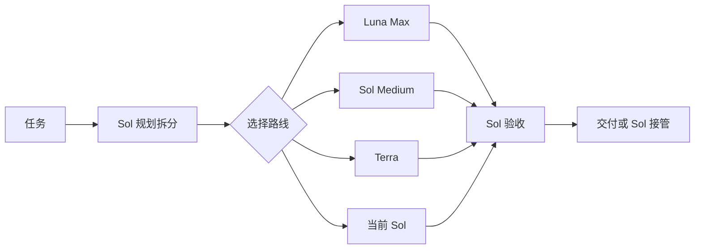
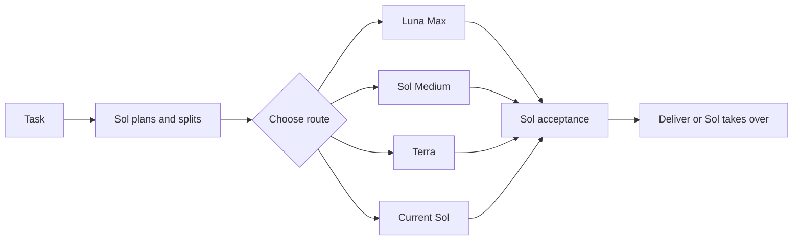

# Codex 路由矩阵

[中文](#中文) | [English](#english)

## 中文

Codex 路由矩阵是给 `gpt-5.6-sol` 使用的多模型协作插件。它让 Sol 继续负责理解需求、规划、拆分、整合和最终验收，同时把边界清楚、适合独立执行的工作交给 Luna Max、Sol Medium 或 Terra。

它解决的不是“每个任务都换模型”，而是两个更实际的问题：复杂任务如何安全并行，以及如何在不降低质量的前提下减少不必要的高价模型调用。

当前版本：[`v0.8.1`](https://github.com/9holy/codex-routing-matrix/releases/tag/v0.8.1)

### 运行原理

1. Sol 先理解任务，短任务或强耦合工作直接完成。
2. 需要拆分时，Sol 为每个工作单元写清目标、范围、文件归属、依赖和验收标准。
3. Luna Max 能可靠完成的低判断、可机械验证工作优先交给 Luna。
4. Luna 不适合时，边界清楚、需要正常判断的独立工作交给 Sol Medium。
5. Terra 只在具体任务上有明确优势时使用，不把“需要深思”本身当作选 Terra 的理由。
6. 互不依赖、不会同时修改同一文件的工作可以并行。
7. Worker 完成后，Sol 检查真实改动、重跑必要验证并最终决定是否接受。能力不足、越界或质量不达标的工作直接回到 Sol。



### 模型分工

| 角色 | 负责什么 |
|---|---|
| 当前 Sol | 理解、规划、拆分、整合、验收和兜底 |
| Luna Max | 规则冻结、判断少、容易验证且能可靠完成的执行工作 |
| Sol Medium | 边界清楚、需要正常判断、可独立验证的工作 |
| Terra XHigh / Max / Ultra | 在具体任务上确实比可用 Sol 路线更合适的工作 |
| Sol Reviewer XHigh | 关键高风险改动的一次独立只读复审 |

质量优先并不等于默认使用最贵模型。插件先判断任务是否适合 Luna；不适合才考虑 Sol Medium、Terra 或当前 Sol。路由一旦确定就保持不变，除非任务边界、可用性或结果发生变化，避免反复切换破坏上下文和缓存收益。

常规独立判断工作优先 Sol Medium；深推理本身不选择 Terra。

### 普通模式与 Super mode

- 普通模式适合日常任务。短任务由当前 Sol 直接完成；只有下派确实有收益时才使用 Worker，通常从一个开始。
- Super mode 适合大量互不依赖、写入不冲突的工作。它支持四层拆分和最多 25 个子线程，但实际并发仍受当前 Codex 宿主容量限制。Sol 仍会验收全部结果，质量标准不会降低。

开启或关闭当前会话的 Super mode：

```text
开启爆种模式
关闭爆种模式
enable super mode
disable super mode
```

### 1M 上下文

1M 上下文默认关闭。下面的精确命令会在全局 `~/.codex/config.toml` 中写入或恢复上下文配置：

```text
开启1M上下文
关闭1M上下文
enable 1M context
disable 1M context
```

开启后写入 `model_context_window = 1000000` 和 `model_auto_compact_token_limit = 900000`。必须重启 Codex 并重新打开同一个任务才会生效；任务历史不会丢失。关闭时恢复开启前的原值。该模式只适合确实需要超长历史的任务，默认路由和 Rule 16 不受影响。

### 安装

本插件尚未进入 OpenAI 公共插件商城。先添加这个 Git Marketplace，再安装插件：

```powershell
codex plugin marketplace add 9holy/codex-routing-matrix --ref main
codex plugin add codex-routing-matrix@codex-routing-matrix
```

首次安装后运行初始化脚本：

```powershell
powershell -NoProfile -ExecutionPolicy Bypass -File "$HOME\.codex\.tmp\marketplaces\codex-routing-matrix\plugins\codex-routing-matrix\scripts\install.ps1"
```

初始化会安装四个具名代理配置，写入无编号的 `Codex Routing Matrix`，并在 `AGENTS.md` 顶部加入一次性的英文 `Meta Rule - Conflict Resolution` 和 `Implementation`。后两条不会被以后安装或配置守护自动恢复、覆盖。

在 `/hooks` 中检查并信任四个 Hook，然后新建任务。升级后只有 Hook 内容发生变化时才需要重新信任。

如果 Cockpit Tools、CC Switch 等工具会覆盖 `config.toml`，再启用配置守护：

```powershell
powershell -NoProfile -ExecutionPolicy Bypass -File "$HOME\.codex\.tmp\marketplaces\codex-routing-matrix\plugins\codex-routing-matrix\scripts\config-guard.ps1" -Mode Install
```

详细说明：[操作指南](docs/OPERATING_GUIDE.md) · [路由矩阵](docs/ROUTING_MATRIX.md) · [需求基线](docs/REQUIREMENTS.md)

旧版 `codex-quality-orchestrator` 用户迁移时，先安装新的 `codex-routing-matrix`，确认新插件和 Hook 正常后，再移除旧插件注册。新安装器会读取旧版代理安装状态，不会重复覆盖代理配置。

## English

Codex Routing Matrix gives a `gpt-5.6-sol` controller a small multi-model team. Sol keeps ownership of understanding, planning, decomposition, integration, and final acceptance. It delegates only bounded work that Luna Max, Sol Medium, or Terra can reliably complete.

The plugin is not designed to switch models for every prompt. It is designed to parallelize larger work safely and avoid expensive routes when a lower-cost capable route can deliver the same quality.

Current release: [`v0.8.1`](https://github.com/9holy/codex-routing-matrix/releases/tag/v0.8.1)

### How it works

1. Sol understands the request and handles short or tightly coupled work directly.
2. When decomposition helps, Sol freezes each unit's goal, scope, file ownership, dependencies, and acceptance checks.
3. Luna Max is the first choice for low-judgment, mechanically verifiable work it can reliably complete.
4. Sol Medium handles bounded independent work that needs normal judgment.
5. Terra is used only for a clear task-specific advantage; deep reasoning alone does not select Terra.
6. Independent, write-safe units may run in parallel.
7. Sol inspects the real changes, reruns necessary checks, and accepts or rejects every result. Capability, scope, or quality failures return directly to Sol.



### Model roles

| Role | Responsibility |
|---|---|
| Current Sol | Understand, plan, split, integrate, verify, and fall back |
| Luna Max | Frozen, low-judgment, mechanically verifiable execution it can reliably complete |
| Sol Medium | Bounded, independently verifiable work that needs normal judgment |
| Terra XHigh / Max / Ultra | Work with a clear task-specific advantage over available Sol routes |
| Sol Reviewer XHigh | One independent read-only review for a critical high-risk change |

Quality first does not mean selecting the most expensive model by default. The plugin checks Luna eligibility first, then considers Sol Medium, Terra, or the current Sol. Once selected, a route stays frozen until the unit, availability, or result changes, which avoids needless context switches and preserves cache value.

### Normal mode and Super mode

- Normal mode is for everyday work. Sol handles short tasks directly and starts with one Worker only when delegation has net value.
- Super mode is for many independent, write-safe units. It supports four delegation levels and up to 25 child threads, subject to the active Codex host's real capacity. Sol still verifies every result and keeps the same quality bar.

Toggle Super mode for the current session:

```text
enable super mode
disable super mode
开启爆种模式
关闭爆种模式
```

### 1M context

1M context is off by default. These exact commands write or restore the global context settings in `~/.codex/config.toml`:

```text
enable 1M context
disable 1M context
开启1M上下文
关闭1M上下文
```

Enabling writes `model_context_window = 1000000` and `model_auto_compact_token_limit = 900000`. Restart Codex and reopen the same task to apply the settings; its history is preserved. Disabling restores the values that existed before enabling. This mode is intended only for tasks that genuinely need very long history and does not change Rule 16 or model routing.

### Install

The plugin is not yet listed in OpenAI's public plugin marketplace. Add its Git Marketplace, then install it:

```powershell
codex plugin marketplace add 9holy/codex-routing-matrix --ref main
codex plugin add codex-routing-matrix@codex-routing-matrix
```

Run first-install setup:

```powershell
powershell -NoProfile -ExecutionPolicy Bypass -File "$HOME\.codex\.tmp\marketplaces\codex-routing-matrix\plugins\codex-routing-matrix\scripts\install.ps1"
```

Setup installs four named agent profiles, adds the unnumbered `Codex Routing Matrix` section, and places one-time English `Meta Rule - Conflict Resolution` and `Implementation` defaults at the top of `AGENTS.md`. Later installs and the configuration guard do not restore or overwrite those two defaults.

Review and trust all four Hooks in `/hooks`, then start a new task. Trust must be renewed only when an update changes Hook content.

Use `config-guard.ps1 -Mode Install` only when another tool may replace `config.toml`.

Detailed documentation: [Operating Guide](docs/OPERATING_GUIDE.en.md) · [Routing Matrix](docs/ROUTING_MATRIX.en.md) · [Requirements](docs/REQUIREMENTS.en.md)

When upgrading from `codex-quality-orchestrator`, install `codex-routing-matrix` first, verify the new plugin and Hooks, then remove the old plugin registration. The new installer reads the old agent-install state and does not create duplicate profiles.

## License

[MIT](LICENSE)
