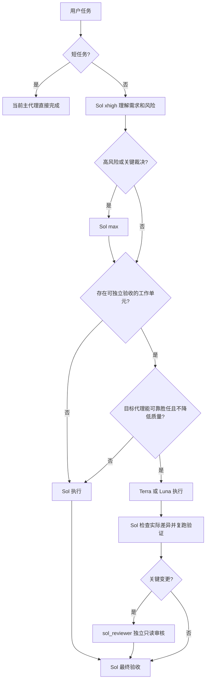

# Codex Quality Orchestrator 操作指南

这份文档说明插件如何做质量编排、哪些决策由 Sol 负责、Hook 会拦截什么，以及如何安全安装、验证和卸载。

## 1. 核心原则

插件不是自动替模型做语义判断的决策树。任务含义、风险、目标模型是否能可靠胜任，由 Sol 根据完整上下文判断；代码只校验已经确定的调用契约。

质量、胜任能力和风险边界是硬约束；满足这些约束后选择算力开支最低的执行组合，速度最后考虑。工作目标、范围或验收边界不清时直接保留给 Sol；仅在边界明确而 Luna 与 Terra 的能力档位难以判断时选择 Terra。不静默降级，也不为了使用子代理而拆分短任务。

短任务必须同时满足目标与验收无歧义、低风险、无需方案选择或诊断、上下文很少且可直接验证；改动大小、文件数量或验证步骤数量只能作为辅助信号。架构、安全、公共接口、生产数据、不可逆操作等高风险事项无论大小都不是短任务。

对每个非短任务，Sol 必须在生产执行前按完整工作单元的最高要求公开一次路由判定。只有输入输出与步骤固定且无需判断的机械子任务才交给 Luna；需要实现判断、多步骤上下文、调试、测试或已裁定接口下普通集成的边界清晰工作交给 Terra；语义消歧、架构、高风险、生产数据、跨代理最终集成与最终裁决保留给 Sol。

同一工作单元的生产执行者及其最低能力层级在执行期间保持稳定，仅在目标、范围或风险实质变化、上下文越界、连续验证失败或选定链路不可用时重新预检，并且只向上升级。代理完成后正常交回 Sol 整合、复核和最终验收不属于改派；新的独立工作单元单独判定。完成语义判定后再检查提供商与认证，不能因目标模型不可用而改派更低层级。这是质量判断，不是代理调用配额。

## 2. 默认工作流



只有至少两个工作单元可以安全并行，且并行确实提升质量或节省明显时间时才并行。写入型子任务必须明确文件范围、成功标准、验证命令和备份状态。

### 2.1 根任务档位边界

根任务模型和推理档位在插件 Hook 运行前由桌面模型选择器、外部配置管理器或 `config.toml` 决定。插件只能约束后续子代理调用，不能把已经启动的 `Sol / max` 或 `Sol / ultra` 根任务自动改成 `xhigh`。

因此，`Sol / xhigh` 是普通非短任务的新任务默认建议，`max` 用于高风险任务，`ultra` 仅用于极少数超复杂长任务。即使根任务已经使用 `max` 或 `ultra`，仍应按胜任能力下派合适的工作单元。

## 3. 模型矩阵

| 角色 | 模型 | 推理档位 | 适用任务 |
|---|---|---|---|
| Sol 直接分析 | `gpt-5.6-sol` | `medium` | 边界清晰的直接分析，不负责多模型统筹或关键验收 |
| Sol 常规执行 | `gpt-5.6-sol` | `high` | 常规多步骤任务、小范围调试和集成 |
| Sol 默认统筹 | `gpt-5.6-sol` | `xhigh` | 普通非短任务的理解、规划、整合和常规验收 |
| Sol 高风险 | `gpt-5.6-sol` | `max` | 架构、安全、公共接口、生产数据、不可逆迁移、公共数据契约、疑难问题和最终裁决 |
| Sol 极复杂 | `gpt-5.6-sol` | `ultra` | 极少数超复杂长任务，不作为日常默认 |
| Terra | `gpt-5.6-terra` | `xhigh` 或 `max` | 多文件实现、调试、测试、文档分析、代码审查及已裁定接口下的普通集成实现 |
| Luna | `gpt-5.6-luna` | 固定 `max` | 输入输出与步骤固定、低风险、可机械验证的简单子任务 |
| 独立审核 | `gpt-5.6-sol` | 固定 `xhigh`、只读 | 关键变更的独立审核 |

`gpt-5.5`、裸 Terra、裸 Luna 和未登记模型禁止下派。

### 3.1 禁止范围

Luna 不处理模糊需求、诊断、架构、安全、公共接口、生产数据或最终裁决。Terra 可以处理测试数据、配置数据和已裁定接口下的普通集成实现，但不处理生产数据、不可逆迁移、公共数据契约或最终质量裁决。`sol_reviewer` 不写入文件，也不能代替统筹 Sol 做最终决定。

### 3.2 调用契约

具名代理的模型由 TOML 固定，调用时不能用 `model` 覆盖。Terra 的档位在允许的 `xhigh/max` 中由 Sol 按任务选择；Luna 和 reviewer 的档位由 TOML 固定：

```text
terra_worker: agent_type + reasoning_effort(xhigh|max) + fork_turns
luna_worker: agent_type + fork_turns
sol_reviewer: agent_type + fork_turns
Sol 升级: model(gpt-5.6-sol) + reasoning_effort + fork_turns
```

`fork_turns` 只能是 `"none"` 或正整数数字字符串。Luna 和 reviewer 不得在调用参数中覆盖固定推理档位；Terra 必须显式传入允许的 `xhigh` 或 `max`。

## 4. Hook 的职责

### SessionStart

- 加载插件内的 Rule 16。
- 检查全局 `AGENTS.md` 的 Rule 16 是否一致。
- 检查 Terra、Luna、reviewer 配置是否缺失。
- 规则匹配且代理配置完整时只输出 `[CQO_ACTIVE]`；不重复注入 Rule 16，也不报告可能被任务选择器覆盖的根默认值。
- 发现冲突或缺失时公开报告，不静默修复或回退。

### PreToolUse

只匹配 `spawn_agent`、`Agent` 和 `collaborationspawn_agent`，并机械检查：

- 工具输入是否为 JSON 对象。
- `agent_type` 是否已登记。
- 模型是否被非法覆盖。
- 推理档位是否在允许范围内。
- `fork_turns` 是否有效。
- 本机 TOML 是否存在并符合模型契约。
- 全局 Rule 16 是否与插件规则冲突。

非法调用直接拒绝并说明原因。Hook 不判断任务语义、不自动改派、不静默降级。

`codex-auto-review / low` 是 Codex 系统权限审查，不属于本插件的工作模型矩阵。

## 5. 安装生命周期

从 GitHub 安装，命令与当前工作目录无关：

```powershell
$marketplace = codex plugin marketplace add 9holy/codex-quality-orchestrator --ref main --json | ConvertFrom-Json
$plugin = codex plugin add "codex-quality-orchestrator@$($marketplace.marketplaceName)" --json | ConvertFrom-Json
powershell -NoProfile -ExecutionPolicy Bypass `
  -File (Join-Path $plugin.installedPath 'scripts\install.ps1')
codex plugin list --json
```

安装器写入范围中的代理配置只有 `%CODEX_HOME%\agents` 中的三个具名代理；同时会在 `%CODEX_HOME%` 写入安装状态、运行时锁和必要的 Force 备份：

- 缺少文件时创建，并记录为插件所有。
- 文件符合契约时保留，不声明所有权。
- 文件冲突时默认停止，不修改任何文件。
- 使用 `-Force` 时先建立带时间戳和 `SHA256SUMS` 的备份，再替换。

安装状态保存在：

```text
%CODEX_HOME%\.codex-quality-orchestrator.install-state.json
```

安装锁在读取状态和计算动作之前获取：

```text
%CODEX_HOME%\.codex-quality-orchestrator.install.lock
```

这样可以避免并发安装依据陈旧状态覆盖备份记录。

安装插件后，在 Codex 中使用 `/hooks` 审核并信任 Hook，再新建任务。已有任务不会热加载新的规则或配置。

运行时验收必须以 `codex plugin list --json` 中的已安装、已启用记录为准。缓存目录可能只是旧安装残留，不能证明插件或 Hook 正在生效。

如果外部提供商切换器、同步工具或脚本会整体替换 `config.toml`，先在 `/hooks` 人工批准当前两项 Hook，再启用通用配置守护器：

```powershell
powershell -NoProfile -ExecutionPolicy Bypass `
  -File (Join-Path $plugin.installedPath 'scripts\config-guard.ps1') `
  -Mode Install
```

守护器与具体配置工具无关，不修改其数据库，也不调用模型。它每秒只比较一次配置文件的时间和大小，只有发生变化才检查插件状态；缺失时使用 `codex plugin marketplace add` 和 `codex plugin add` 恢复原生注册，然后写回用户已经批准的精确 Hook 信任记录。每次写入前都会创建同目录时间戳备份。已存在但不同的 Hook 哈希不会被覆盖，定义变化后必须重新审核。未使用配置切换工具的用户不需要安装守护器。

`Install` 自动登录启动模式目前仅支持 Windows；其他平台可以显式运行 `-Mode Repair` 做单次修复。守护器把信任记录绑定到安装时的 marketplace 来源、插件版本和 Hook 文件摘要，任一身份变化都会停止自动恢复并要求重新审核。

随后运行真实宿主烟雾验证：

```powershell
powershell -NoProfile -ExecutionPolicy Bypass `
  -File .\plugins\codex-quality-orchestrator\scripts\runtime-smoke.ps1
```

该脚本启动一次临时只读 `codex exec` 宿主会话，并设置随机 nonce 与系统临时目录中的证明路径。SessionStart Hook 只在该环境变量存在时写入包含 nonce 的证明文件；脚本校验证明文件、Hook 事件名和 nonce，不让模型自报 Hook 状态。成功输出中的 `SessionStartHookTrust` 和 `SessionStart` 必须为 `PASS`；若模型请求因用量或认证失败但证明文件已写入，`ModelProbe` 会明确为 `UNAVAILABLE`，不能把它解释为模型调用成功。全局 Rule 16 不存在时允许插件注入 canonical 规则，规则冲突或缺少具名代理配置时失败。它不同于直接执行 Hook 脚本的单元测试。

脚本禁止使用 `--dangerously-bypass-hook-trust`，也不让模型自报 Hook 是否存在。未通过 `/hooks` 信任当前精确 SessionStart 定义时必须失败；一次性旁路只证明 Hook 在绕过信任检查后可执行，不能作为安装验收证据。

SessionStart 与 PreToolUse 是独立 Hook 定义。上述烟雾输出会明确把 `PreToolUseHookTrust` 标为 `NOT_VERIFIED`；必须在 `/hooks` 审核两项定义，并在新任务中确认插件 PreToolUse 能拒绝非法代理调用。如果系统中仍有安装插件前手工配置的全局路由 Hook，完成这两项验证后才能备份并移除，避免双重执行和规则漂移。验证失败时保留或恢复旧 Hook，不得静默迁移。

安装器遇到已存在且符合契约的代理配置时会将其视为外部文件，不声明所有权。这种情况下安装状态文件可以不存在，不能仅据此判定安装失败；插件注册、Hook 加载和代理配置应分别核验。

## 6. 卸载生命周期

```powershell
powershell -NoProfile -ExecutionPolicy Bypass `
  -File (Join-Path $HOME '.codex\.codex-quality-orchestrator-guard\config-guard.ps1') `
  -Mode Uninstall
codex plugin remove codex-quality-orchestrator@codex-quality-orchestrator --json
powershell -NoProfile -ExecutionPolicy Bypass `
  -File .\plugins\codex-quality-orchestrator\scripts\uninstall.ps1
codex plugin marketplace remove codex-quality-orchestrator --json
```

未启用配置守护器时跳过第一条命令。

卸载器依据安装状态处理文件：

| 文件状态 | 卸载行为 |
|---|---|
| 插件创建且未修改 | 删除 |
| `-Force` 替换且未再修改 | 恢复安装前版本 |
| 用户原本已有 | 保留 |
| 安装后被用户修改 | 保留 |
| 所有权状态缺失 | 默认保留 |

恢复路径必须位于 `agents` 目录内，不能通过状态文件跳出目录。

## 7. 验证和打包

源码验证：

```powershell
powershell -NoProfile -ExecutionPolicy Bypass `
  -File .\plugins\codex-quality-orchestrator\scripts\verify.ps1
```

静态验证包含 JSON、Node 与 PowerShell 语法、TOML 契约、Rule 16 一致性、SessionStart 脚本输出契约、9 条允许和 12 条拒绝路由、安装所有权、Force 恢复和锁顺序测试。它不经过宿主插件发现与 Hook 信任链路；安装后的运行时验收使用 `runtime-smoke.ps1`。

打包：

```powershell
powershell -NoProfile -ExecutionPolicy Bypass `
  -File .\plugins\codex-quality-orchestrator\scripts\package.ps1
```

打包脚本会：

1. 先验证源码。
2. 使用临时 staging 目录复制文件，并保留隐藏的 `.codex-plugin` manifest。
3. 生成单一插件根目录的 ZIP，并强制条目路径使用 `/`。
4. 解压 ZIP 后直接运行独立验证，确保成品不依赖仓库级 marketplace。
5. 拒绝反斜杠或根目录异常的 ZIP 条目并输出 SHA-256。

## 8. 发布核验

- 仓库：[9holy/codex-quality-orchestrator](https://github.com/9holy/codex-quality-orchestrator)
- 目标版本：`v0.1.4`
- Release 资产与 SHA-256 必须以该版本的 GitHub Release 页面为准。
- 发布完成只以当前提交的 Windows、Ubuntu Actions 均通过为准，不能沿用旧提交结果。
- CI 必须把 Windows 生成的发布 ZIP 交给 Ubuntu 解压并复跑独立验证，不能只验证各平台自行生成的产物。

## 9. 明确边界

- 插件不能替 Sol 判断任务语义。
- 插件不能改写已经选定的根任务模型或推理档位。
- Hook 必须被 Codex 信任并启用，否则不会执行机械拦截。
- `sol_reviewer` 的只读能力最终受宿主权限控制，TOML 不是绝对安全边界。
- 异常终止后若遗留安装锁，脚本会 fail-closed；确认没有活动安装进程后再清理锁。
