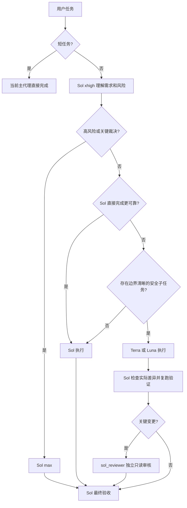

# Codex Quality Orchestrator 操作指南

这份文档说明插件如何做质量编排、哪些决策由 Sol 负责、Hook 会拦截什么，以及如何安全安装、验证和卸载。

## 1. 核心原则

插件不是自动替模型做语义判断的决策树。任务含义、风险、目标模型是否能可靠胜任，由 Sol 根据完整上下文判断；代码只校验已经确定的调用契约。

质量和胜任能力优先于速度和成本。存在疑问时保留任务给 Sol 或向上升级，不静默降级，也不为了使用子代理而拆分短任务。

## 2. 默认工作流



只有至少两个工作单元可以安全并行，且并行确实提升质量或节省明显时间时才并行。写入型子任务必须明确文件范围、成功标准、验证命令和备份状态。

## 3. 模型矩阵

| 角色 | 模型 | 推理档位 | 适用任务 |
|---|---|---|---|
| Sol 直接分析 | `gpt-5.6-sol` | `medium` | 边界清晰的直接分析，不负责多模型统筹或关键验收 |
| Sol 常规执行 | `gpt-5.6-sol` | `high` | 常规多步骤任务、小范围调试和集成 |
| Sol 默认统筹 | `gpt-5.6-sol` | `xhigh` | 普通非短任务的理解、规划、整合和常规验收 |
| Sol 高风险 | `gpt-5.6-sol` | `max` | 架构、安全、公共接口、数据修改、疑难问题和最终裁决 |
| Sol 极复杂 | `gpt-5.6-sol` | `ultra` | 极少数超复杂长任务，不作为日常默认 |
| Terra | `gpt-5.6-terra` | `xhigh` 或 `max` | 多文件实现、调试、测试、文档分析和代码审查 |
| Luna | `gpt-5.6-luna` | 固定 `max` | 规则确定、低风险、可机械验证的简单子任务 |
| 独立审核 | `gpt-5.6-sol` | 固定 `xhigh`、只读 | 关键变更的独立审核 |

`gpt-5.5`、裸 Terra、裸 Luna 和未登记模型禁止下派。

### 3.1 禁止范围

Luna 不处理模糊需求、架构、安全、公共接口、数据修改或最终裁决。Terra 不做最终质量裁决。`sol_reviewer` 不写入文件，也不能代替统筹 Sol 做最终决定。

### 3.2 调用契约

具名代理的模型由 TOML 固定，调用时不能用 `model` 覆盖。Terra 的档位在允许的 `xhigh/max` 中由 Sol 按任务选择；Luna 和 reviewer 的档位由 TOML 固定：

```text
terra_worker: agent_type + reasoning_effort(xhigh|max) + fork_turns
luna_worker: agent_type + fork_turns
sol_reviewer: agent_type + fork_turns
Sol 升级: model(gpt-5.6-sol) + reasoning_effort + fork_turns
```

`fork_turns` 只能是 `"none"` 或正整数数字字符串。Luna 和 reviewer 不得在调用参数中覆盖固定推理档位；Terra 必须显式传入允许的 `xhigh` 或 `max`。

## 4. Hook 的职责

### SessionStart

- 加载插件内的 Rule 16。
- 检查全局 `AGENTS.md` 的 Rule 16 是否一致。
- 检查 Terra、Luna、reviewer 配置是否缺失。
- 发现冲突或缺失时公开报告，不静默修复或回退。

### PreToolUse

只匹配 `spawn_agent`、`Agent` 和 `collaborationspawn_agent`，并机械检查：

- 工具输入是否为 JSON 对象。
- `agent_type` 是否已登记。
- 模型是否被非法覆盖。
- 推理档位是否在允许范围内。
- `fork_turns` 是否有效。
- 本机 TOML 是否存在并符合模型契约。
- 全局 Rule 16 是否与插件规则冲突。

非法调用直接拒绝并说明原因。Hook 不判断任务语义、不自动改派、不静默降级。

`codex-auto-review / low` 是 Codex 系统权限审查，不属于本插件的工作模型矩阵。

## 5. 安装生命周期

从仓库根目录执行：

```powershell
powershell -NoProfile -ExecutionPolicy Bypass `
  -File .\plugins\codex-quality-orchestrator\scripts\install.ps1

codex plugin marketplace add .
codex plugin add codex-quality-orchestrator@codex-quality-orchestrator --json
```

安装器写入范围中的代理配置只有 `%CODEX_HOME%\agents` 中的三个具名代理；同时会在 `%CODEX_HOME%` 写入安装状态、运行时锁和必要的 Force 备份：

- 缺少文件时创建，并记录为插件所有。
- 文件符合契约时保留，不声明所有权。
- 文件冲突时默认停止，不修改任何文件。
- 使用 `-Force` 时先建立带时间戳和 `SHA256SUMS` 的备份，再替换。

安装状态保存在：

```text
%CODEX_HOME%\.codex-quality-orchestrator.install-state.json
```

安装锁在读取状态和计算动作之前获取：

```text
%CODEX_HOME%\.codex-quality-orchestrator.install.lock
```

这样可以避免并发安装依据陈旧状态覆盖备份记录。

安装插件后，在 Codex 中使用 `/hooks` 审核并信任 Hook，再新建任务。已有任务不会热加载新的规则或配置。

## 6. 卸载生命周期

```powershell
codex plugin remove codex-quality-orchestrator@codex-quality-orchestrator --json
powershell -NoProfile -ExecutionPolicy Bypass `
  -File .\plugins\codex-quality-orchestrator\scripts\uninstall.ps1
codex plugin marketplace remove codex-quality-orchestrator --json
```

卸载器依据安装状态处理文件：

| 文件状态 | 卸载行为 |
|---|---|
| 插件创建且未修改 | 删除 |
| `-Force` 替换且未再修改 | 恢复安装前版本 |
| 用户原本已有 | 保留 |
| 安装后被用户修改 | 保留 |
| 所有权状态缺失 | 默认保留 |

恢复路径必须位于 `agents` 目录内，不能通过状态文件跳出目录。

## 7. 验证和打包

源码验证：

```powershell
powershell -NoProfile -ExecutionPolicy Bypass `
  -File .\plugins\codex-quality-orchestrator\scripts\verify.ps1
```

验证包含 JSON、Node 语法、TOML 契约、Rule 16 一致性、9 条允许和 12 条拒绝路由、安装所有权、Force 恢复和锁顺序测试。

打包：

```powershell
powershell -NoProfile -ExecutionPolicy Bypass `
  -File .\plugins\codex-quality-orchestrator\scripts\package.ps1
```

打包脚本会：

1. 先验证源码。
2. 使用临时 staging 目录复制文件，并保留隐藏的 `.codex-plugin` manifest。
3. 生成单一插件根目录的 ZIP。
4. 解压 ZIP 后直接运行独立验证，确保成品不依赖仓库级 marketplace。
5. 输出 SHA-256。

## 8. 当前发布物

- 仓库：[9holy/codex-quality-orchestrator](https://github.com/9holy/codex-quality-orchestrator)
- Release：[v0.1.0](https://github.com/9holy/codex-quality-orchestrator/releases/tag/v0.1.0)
- ZIP SHA-256：`c683961540785157c0370d86d424c1d221d825aded77e8b745dec34df39ea13c`
- GitHub Actions：Windows 和 Ubuntu 均通过

## 9. 明确边界

- 插件不能替 Sol 判断任务语义。
- Hook 必须被 Codex 信任并启用，否则不会执行机械拦截。
- `sol_reviewer` 的只读能力最终受宿主权限控制，TOML 不是绝对安全边界。
- 异常终止后若遗留安装锁，脚本会 fail-closed；确认没有活动安装进程后再清理锁。
